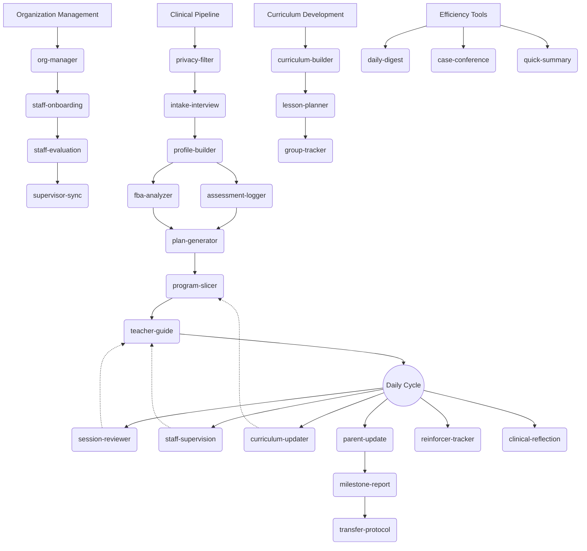

# ABA Clinical Agent

> AI-powered clinical supervision automation for Applied Behavior Analysis, built on LLM + Obsidian knowledge base

**29 Claude Code Skills** covering the entire workflow from intake to discharge, giving every BCBA a digital supervision assistant that never clocks out.

[](https://www.gnu.org/licenses/agpl-3.0)

[中文版 README](README.zh-CN.md)

---

## System Overview



---

## What Is This?

An **AI-powered clinical workstation** designed for ABA (Applied Behavior Analysis) practitioners:

- **29 Automation Skills**: Covering de-identification, intake, assessment, IEP/BIP planning, teaching, daily supervision, reporting, and transition
- **Obsidian Knowledge Base**: 8-layer standardized directory structure + bidirectional linking = a living digital clinic
- **Professional Reference Dictionaries**: VB-MAPP domains, prompt hierarchy, competency matrix, and developmental sequences
- **Data Analysis Scripts**: Automatic PDF extraction + trend analysis + Excel export
- **Safety Guardrails**: Diff preview confirmation, frontmatter tracking, de-identification workflow, human-in-the-loop

---

## Who Is This For?

| Role | What You Get |
|:---|:---|
| **BCBA / Lead Supervisor** | Auto-generated IEP/FBA/family letters/reflections, data trend analysis, operational dashboard |
| **Assistant Supervisor / RBT** | Auto-generated teaching guides, instant session feedback, curriculum advancement support |
| **ABA Agency Director** | Standardized management workflows, staff growth tracking, org chart management, case conference materials |
| **Special Ed Tech Developer** | Complete skill development framework, extensible professional dictionaries, assessment toolchain |

---

## 5-Minute Quick Start

### Prerequisites

- [Claude Code](https://docs.anthropic.com/en/docs/claude-code) or another AI client supporting `.claude/skills/` (Cursor, Cline, etc.)
- [Obsidian](https://obsidian.md/) (recommended for visual knowledge base browsing; not required)
- Python 3.7+ (for the setup script)

### Step 1: Clone the Repository

```bash
git clone https://github.com/open-behavior-analysis/aba-clinical-agent.git
cd aba-clinical-agent
```

### Step 2: Set Up Language

```bash
# English
python scripts/setup.py --lang en

# Chinese (default)
python scripts/setup.py --lang zh-CN
```

This copies the selected language's skills, vault template, and documentation into their active locations.

### Step 3: Configure Permissions

```bash
cp .claude/settings.local.json.example .claude/settings.local.json
# Edit permission settings for your environment
```

### Step 4: Start Using

Launch Claude Code (or your AI client) in the project root and enter your first command:

```
Please read CLAUDE.md and enter the clinical supervisor role.
I have a new case named "Alex" — please run intake-interview and tell me what information you need.
```

> Want to see it in action first? Check out the demo case at `Obsidian-Vault/01-Clients/Client-Demo-Alex/` — a fully fictional case showcasing the system's end-to-end output.

---

## 29 Skills at a Glance

### Clinical Pipeline (16 Skills)

| Skill | Trigger Phrases | Function |
|:---|:---|:---|
| `privacy-filter` | "de-identify this" | Real name to code, prevent data leaks |
| `intake-interview` | "new client / intake" | New case intake + directory initialization |
| `profile-builder` | "build master profile" | Deepen the Master Profile |
| `assessment-logger` | "VB-MAPP / assessment" | Assessment data to structured report |
| `fba-analyzer` | "behavior analysis / ABC" | Functional behavior analysis + competing behavior model |
| `reinforcer-tracker` | "reinforcer / satiation" | Preference assessment + satiation alerts |
| `plan-generator` | "IEP / treatment plan" | Full IEP/BIP with prerequisite chains and fading plans |
| `program-slicer` | "break down / how to teach" | Goals to discrete teaching programs + prompt fading |
| `curriculum-updater` | "mastered / next target" | Mastery confirmation + curriculum change order |
| `session-reviewer` | "session notes" | Therapist feedback analysis + daily home extension |
| `staff-supervision` | "observation / supervision" | Clinical observation notes to staff growth record |
| `teacher-guide` | "teaching guide / cheat sheet" | One-page teaching reference sheet |
| `parent-update` | "family letter / parent update" | Emotionally supportive weekly family letter |
| `clinical-reflection` | "weekly reflection" | Weekly clinical reflection + system learning |
| `milestone-report` | "milestone / progress report" | Baseline vs. current comparison report |
| `transfer-protocol` | "transition / handover" | Full lifecycle transition protocol |

### Organization Management (5 Skills)

| Skill | Trigger Phrases | Function |
|:---|:---|:---|
| `staff-onboarding` | "new therapist / onboarding" | Staff profile creation + growth record init |
| `org-manager` | "org chart / caseload" | 3-tier org structure + case assignment |
| `staff-evaluation` | "competency / promotion" | Competency assessment + L1-L6 promotion pathway |
| `supervisor-sync` | "team meeting / sync" | Supervision meeting brief + information cascade |
| `daily-digest` | "daily summary" | One-page operational dashboard |

### Curriculum Development (3 Skills)

| Skill | Trigger Phrases | Function |
|:---|:---|:---|
| `curriculum-builder` | "design course" | Structured course outline |
| `lesson-planner` | "write lesson plan" | Single-session detailed lesson plan |
| `group-tracker` | "group session tracking" | Group session recording + outcome evaluation |

### Efficiency & Data Tools (4 Skills) + System (1 Skill)

| Skill | Trigger Phrases | Function |
|:---|:---|:---|
| `case-conference` | "case conference" | Full case conference materials package |
| `quick-summary` | "quick brief" | 5-second full-case intelligence aggregation |
| `data-trend` | "analyze data trends" | Session PDF to trend analysis |
| `aba-fusion-compare` | "inclusion data comparison" | Inclusion feedback to IEP goal attainment |
| `skill-creator` | "create new skill" | Skill development / evaluation / optimization framework |

---

## Architecture

```
CLAUDE.md          -> Role definition: AI's professional boundaries and absolute directives
    |
_config.md         -> Global config: directory standards, naming rules, operational protocols
    |
_router.md         -> Skill router: user keywords -> automatic skill dispatch
    |
SKILL.md (x29)     -> Skill definitions: input/output/execution steps for each skill
    |
references/ (x4)   -> Knowledge dictionaries: VB-MAPP, prompt hierarchy, competency matrix, developmental sequences
```

For detailed architecture documentation, see [docs/architecture.md](docs/architecture.md).

---

## Demo Case

The repository includes a fully fictional demo case **Client-Demo-Alex** (4-year-old boy, ASD Level 2), showcasing the system's end-to-end output:

```
Obsidian-Vault/01-Clients/Client-Demo-Alex/
├── Client-Demo-Alex - Intake Form.md          <- intake-interview output
├── Client-Demo-Alex - Master Profile.md       <- profile-builder output
├── Client-Demo-Alex - Skill Assessment.md     <- assessment-logger output
├── Client-Demo-Alex - FBA Report.md           <- fba-analyzer output
├── Client-Demo-Alex - IEP-2026-01-15.md       <- plan-generator output
├── Client-Demo-Alex - Reinforcer Assessment.md <- reinforcer-tracker output
├── Client-Demo-Alex - Milestone Report.md     <- milestone-report output
├── Client-Demo-Alex - Communication Log.md
└── Client-Demo-Alex - Curriculum Change Tracker.md <- curriculum-updater output
```

---

## Multi-Language Support

This project supports both **English** and **Chinese (Simplified)**. Use the setup script to switch:

```bash
python scripts/setup.py --lang en       # English
python scripts/setup.py --lang zh-CN    # Chinese (default)
```

The setup script copies the selected language's skills, vault template, CLAUDE.md, and documentation into their active locations. Your clinical data in `Obsidian-Vault/` is never overwritten.

---

## Hosted Service (Coming Soon)

Deployment too complex? We're building a **one-click hosted service** — a cloud environment pre-configured with Claude Code + Obsidian CLI + all Skills, ready to use on login.

- **Personal plan**: For independent BCBAs
- **Agency plan**: Multi-seat + custom skill development

Follow progress: [GitHub Discussions](../../discussions)

---

## Contributing

We welcome all forms of contribution! See [CONTRIBUTING.md](CONTRIBUTING.md) for details.

Especially welcome:
- New skill submissions (follow skill-creator standards)
- Knowledge base concept cards (08-Knowledge/concepts/)
- Reference dictionary extensions (ABLLS-R, Vineland, etc.)
- Translations and localization

---

## License

This project is licensed under [AGPL-3.0](LICENSE). You may freely use and modify it, but derivative works or SaaS offerings based on this project must be open-sourced under the same license.

---

## Disclaimer

This system is a clinical support tool and **does not constitute medical advice of any kind**. All AI-generated content is for reference only. Final clinical decisions must be made by qualified, licensed professionals. See [DISCLAIMER.md](DISCLAIMER.md) for details.
