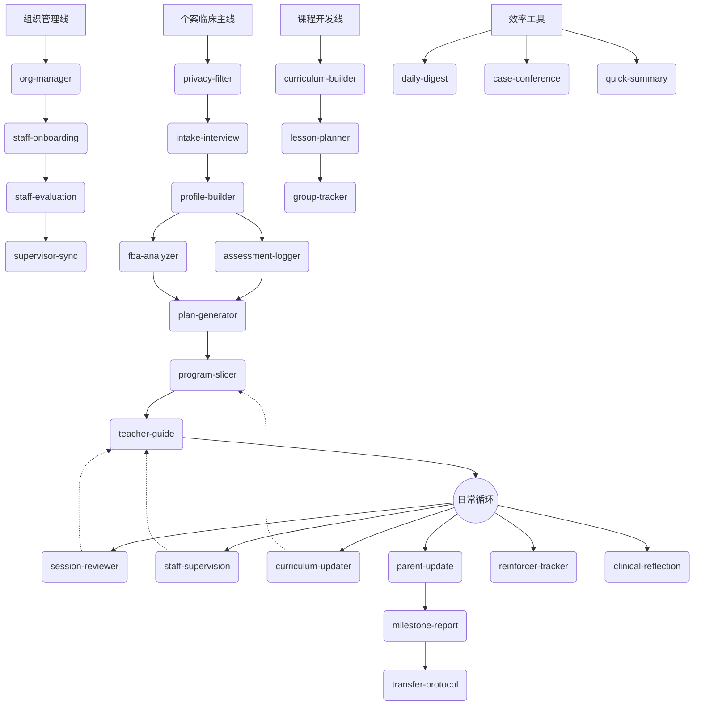

# ABA Clinical Agent

> 基于大语言模型 + Obsidian 知识库的 ABA 临床督导自动化系统

**29 个 Claude Code Skills** 覆盖从个案建档到结业转衔的全流程，让每个 BCBA 都拥有一个永不下班的数字化督导助手。

[](https://www.gnu.org/licenses/agpl-3.0)

---

## 系统能力一览



---

## 这是什么？

一套为 ABA（应用行为分析）从业者设计的**AI 驱动临床工作台**：

- **29 个自动化技能**：覆盖脱敏→建档→评估→方案→教学→日常督导→报告→转衔全链路
- **Obsidian 知识库**：8 层标准目录结构 + 双链索引 = 活的诊所数字化底座
- **专业知识字典**：VB-MAPP 领域、辅助层级、胜任力矩阵、发展序列 4 大参考库
- **数据分析脚本**：PDF 反馈表自动提取 + 趋势分析 + Excel 导出
- **安全护栏**：Diff 预览确认、frontmatter 追踪、脱敏流程、人工在环

---

## 谁适合用？

| 角色 | 你能得到什么 |
|:---|:---|
| **BCBA / 总督导** | 自动生成 IEP/FBA/家书/复盘，数据趋势分析，全局运营速览 |
| **分督导 / RBT** | 实操单自动生成，课后反馈秒回，课题升级决策支持 |
| **ABA 机构负责人** | 标准化管理流程，教师成长追踪，组织架构管理，个案研讨材料包 |
| **特教技术开发者** | 完整的 Skill 开发框架，可扩展的专业知识字典，评估工具链 |

---

## 5 分钟快速上手

### 前置条件

- [Claude Code](https://docs.anthropic.com/en/docs/claude-code) 或其他支持 `.claude/skills/` 的 AI 客户端（Cursor、Cline 等）
- [Obsidian](https://obsidian.md/)（推荐，用于可视化浏览知识库；非必须）
- Python 3.7+（用于语言设置脚本）

### 第一步：克隆仓库

```bash
git clone https://github.com/open-behavior-analysis/aba-clinical-agent.git
cd aba-clinical-agent
```

### 第二步：设置语言

```bash
# 中文版（默认）
python scripts/setup.py --lang zh-CN

# 英文版
python scripts/setup.py --lang en
```

### 第三步：配置权限

```bash
cp .claude/settings.local.json.example .claude/settings.local.json
# 根据你的环境编辑权限配置
```

### 第四步：开始使用

在项目根目录启动 Claude Code（或你的 AI 客户端），输入第一条指令：

```
请阅读 CLAUDE.md 并进入督导角色。
我刚接了一个新个案叫"多多"，请调用 intake-interview，告诉我你需要什么信息？
```

> 想先看看效果？查看示范个案 `Obsidian-Vault/01-Clients/Client-Demo-小星/`，这是一个完整的虚构个案，展示了系统全流程的输出效果。

---

## 29 项技能速查表

### 个案临床线（16 项）

| 技能 | 触发词 | 功能 |
|:---|:---|:---|
| `privacy-filter` | "帮我脱敏" | 真名→代号，防泄露 |
| `intake-interview` | "新孩子/初访" | 新个案建档 + 目录初始化 |
| `profile-builder` | "完善核心档案" | 深化 Master File |
| `assessment-logger` | "VB-MAPP/评估" | 评估数据→结构化报告 |
| `fba-analyzer` | "行为分析/ABC" | 功能行为分析 + 竞争模型 |
| `reinforcer-tracker` | "强化物/奖励没用了" | 偏好排摸 + 饱和预警 |
| `plan-generator` | "IEP/方案" | 全维度 IEP/BIP 制定 |
| `program-slicer` | "拆解/怎么教" | 目标→教学切片 + 辅助路线 |
| `curriculum-updater` | "课题达标/换课题" | 达标确认→课题变更单 |
| `session-reviewer` | "课后记录" | 教师反馈分析 + 每日外挂 |
| `staff-supervision` | "听课/督导反馈" | 听课观察→教师档案追加 |
| `teacher-guide` | "实操单/实操小抄" | 一页纸教学指引 |
| `parent-update` | "家书/家长沟通" | 高情商周反馈信 |
| `clinical-reflection` | "复盘/周总结" | 督导经验沉淀 |
| `milestone-report` | "喜报/阶段报告" | 基线 vs 当前对比报告 |
| `transfer-protocol` | "转衔/移交" | 全生命周期移交协议 |

### 组织管理线（5 项）

| 技能 | 触发词 | 功能 |
|:---|:---|:---|
| `staff-onboarding` | "新老师入职" | 教师建档 + 成长档案初始化 |
| `org-manager` | "组织架构/caseload" | 三级架构维护 + 个案分配 |
| `staff-evaluation` | "考核/晋升" | 胜任力评估 + L1-L6 晋升路线 |
| `supervisor-sync` | "督导会/周会" | 督导会简报 + 信息级联 |
| `daily-digest` | "每日总结" | 一页纸运营速览 |

### 课程开发线（3 项）

| 技能 | 触发词 | 功能 |
|:---|:---|:---|
| `curriculum-builder` | "设计课程" | 结构化课程大纲 |
| `lesson-planner` | "写教案" | 单课详细教案 |
| `group-tracker` | "团体课追踪" | 课程过程记录 + 评估 |

### 效率工具线（2 项）+ 数据分析（2 项）+ 系统工具（1 项）

| 技能 | 触发词 | 功能 |
|:---|:---|:---|
| `case-conference` | "个案研讨" | 研讨会全套材料包 |
| `quick-summary` | "电梯简报" | 5 秒全库情报聚合 |
| `data-trend` | "分析数据趋势" | 个训 PDF→趋势分析 |
| `aba-fusion-compare` | "融合数据对比" | 融合反馈→IEP 达标判定 |
| `skill-creator` | "创建新技能" | Skill 开发/评估/优化框架 |

---

## 系统架构

```
CLAUDE.md          → 角色定义：AI 的专业边界和绝对红线
    ↓
_config.md         → 全局配置：目录规范、命名规则、操作标准
    ↓
_router.md         → 技能路由：用户关键词 → Skill 自动映射
    ↓
SKILL.md (x29)     → 技能定义：每个 Skill 的输入/输出/执行步骤
    ↓
references/ (x4)   → 知识字典：VB-MAPP、辅助层级、胜任力矩阵、发展序列
```

更详细的架构说明请参阅 [docs/architecture.md](docs/architecture.md)。

---

## 看示范个案

仓库内置了一个完全虚构的示范个案 **Client-Demo-小星**（4 岁男孩，ASD Level 2），展示了系统全流程的输出效果：

```
Obsidian-Vault/01-Clients/Client-Demo-小星/
├── Client-Demo-小星 - 初访信息表.md      ← intake-interview 输出
├── Client-Demo-小星 - 核心档案.md        ← profile-builder 输出
├── Client-Demo-小星 - 能力评估.md        ← assessment-logger 输出
├── Client-Demo-小星 - FBA 分析.md        ← fba-analyzer 输出
├── Client-Demo-小星 - IEP-2026-01-15.md  ← plan-generator 输出
├── Client-Demo-小星 - 强化物评估.md      ← reinforcer-tracker 输出
├── Client-Demo-小星 - 里程碑报告.md      ← milestone-report 输出
├── Client-Demo-小星 - 沟通记录.md
└── Client-Demo-小星 - 课题变更追踪.md    ← curriculum-updater 输出
```

---

## 托管服务 (Coming Soon)

自行部署太复杂？我们即将推出**一键托管服务**——登录即用的云环境，预配置 Claude Code + Obsidian CLI + 全套 Skills。

- 个人版：适合独立 BCBA
- 机构版：多席位 + 定制 Skill 开发

关注进展：[GitHub Discussions](../../discussions)

---

## 参与贡献

我们欢迎所有形式的贡献！详见 [CONTRIBUTING.md](CONTRIBUTING.md)。

特别欢迎：
- 新 Skill 提交（遵循 skill-creator 规范）
- 知识库概念卡片（08-Knowledge/概念库/）
- 参考字典扩充（ABLLS-R、Vineland 等）
- 翻译（英文版）

---

## 许可证

本项目采用 [AGPL-3.0](LICENSE) 许可证。你可以自由使用和修改，但基于本项目的修改版本或 SaaS 服务必须以相同许可证开源。

---

## 免责声明

本系统为临床辅助工具，**不构成任何形式的医疗建议**。所有 AI 生成内容仅供参考，最终临床决策必须由持有合法执业资格的专业人员做出。详见 [DISCLAIMER.md](DISCLAIMER.md)。
