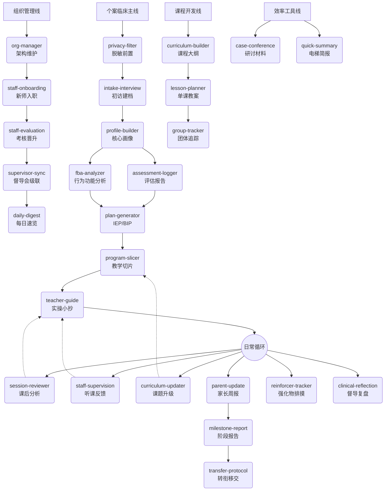

# ABA Clinical Agent: 29 项自动化临床技能手册

本系统内置 29 个专为 BCBA 督导与特教机构设计的自动化技能（Skills）。
当你在大模型输入框中提到**触发词**或遇到对应场景时，Agent 将自动调用对应的技能，读取指定的知识库，并执行规范化的多文件写入。

---

## 核心工作流大局观

整个系统分为四条主线。你可以顺着时间轴使用：

---

## 第一部分：人事与入组基建 (HR & Onboarding)

| 技能名 | 触发暗号 | 它能帮你干什么？ |
|:---|:---|:---|
| **`privacy-filter`** | "帮我把这段脱敏" | 接收带真名的评估表/原始笔记，过滤成代号（如 Client-Demo-小星），防止泄露。 |
| **`intake-interview`** | "接了个新孩子/初访" | 创建 `01-Clients` 文件夹，榨取初访记录里的"家庭泛化能力"和"雷区"，生成骨架档案。 |
| **`profile-builder`** | "完善核心档案" | 基于前期的各路碎片，拼凑出一份极致结构化的核心 Master File。 |
| **`staff-onboarding`** | "来了个新老师" | 建立教师文件夹，生成包含"强项/短板/踩坑区"的初始职业成长基线。 |

## 第二部分：评估与方案制定 (Assessment & Planning)

| 技能名 | 触发暗号 | 它能帮你干什么？ |
|:---|:---|:---|
| **`assessment-logger`** | "刚做完 VB-MAPP" | 读取测试散点数据，对接内部的专业域字典，生成表格化《能力评估报告》。 |
| **`fba-analyzer`** | "这孩子最近老尖叫" | 读取 ABC 数据流，推导行为核心功能，给出统一的"绝对不能做的红线动作"。 |
| **`plan-generator`** | "生成IEP/写下阶段方案" | 阅读评估单和 FBA 红线，写明长短期目标及配套的教学范式（DTT/NET）。 |
| **`program-slicer`** | "怎么教穿鞋/拆解切片" | 将大目标切烂，对接内置《辅助层级字典》，给出从"全物理→独立"退场的明确梯队。 |

## 第三部分：日常磨课与迭代 (Session Review & Iteration)

> 注意：这里有 3 个最容易混淆的实操生成场景！

| 技能名 | 触发暗号 | 它能帮你干什么？ |
|:---|:---|:---|
| **`teacher-guide`** | "写下节课的实操单" | **基于静止文档**：根据 IEP 和孩子的核心雷区，提炼一页只有干货的"战前外挂/小抄"，发给老师。 |
| **`staff-supervision`** | "我刚看了老师上课" | **督导视角输入**：记录督导自己的随笔，生成情感价值反馈，并静默追加到教师成长档案中。 |
| **`session-reviewer`** | "老师交了今天的课后记录" | **老师视角输入**：阅读老师交上来的表格卡片，给予肯定、给出"每日外挂"，同样追加更新教师档案。 |
| **`curriculum-updater`** | "课题达标了/换课题" | 当某个教学项目达标（连续3天≥80%），执行达标确认→下一课题决策→变更单生成。 |
| **`reinforcer-tracker`** | "找找新强化物" | 当孩子玩腻了当前玩具，重新排摸近期的偏好流，划分出"杀手锏"、"储备"与"待测试"。 |

## 第四部分：汇报、沟通与移交 (Comms & Transfer)

| 技能名 | 触发暗号 | 它能帮你干什么？ |
|:---|:---|:---|
| **`quick-summary`** | "马上开战前短会" | 5秒钟看遍全库（IEP进度、强化物、死穴），甩出一张供你快速回忆的摘要名片。 |
| **`parent-update`** | "写家书/小作文" | 读取上周答应过家长的事、本周的进阶点，写一封兼顾情绪支撑与大白话行为学原理的周报。 |
| **`clinical-reflection`** | "写复盘日记" | 沉淀个人督导经验法则，静默追加到灵感库，甚至生出机构培训用的 SOP 草案。 |
| **`milestone-report`** | "出喜报/结业" | 从起点测算变化，用感性文字包裹冰冷数据。 |
| **`transfer-protocol`** | "移交档案" | 当个案转向校园影子老师或其它机构时，榨取最重要的指令控制法和医疗禁忌，输出移交书。 |

## 第五部分：组织管理线 (Organization Management)

| 技能名 | 触发暗号 | 它能帮你干什么？ |
|:---|:---|:---|
| **`org-manager`** | "组织架构/谁管谁" | 维护三级组织架构（总督导→分督导→教师），分配个案，调整 caseload。 |
| **`staff-evaluation`** | "考核/能不能升级" | 对教师进行胜任力考核，管理 L1(实习)→L6(总督导) 的全晋升路线。 |
| **`supervisor-sync`** | "准备督导会" | 信息级联：汇总各分督导的最新情况，生成团队会议议程和简报。 |
| **`daily-digest`** | "今天怎么样/下班前" | 一页纸运营速览：今日新增日志、警报事件、待办跟进。 |

## 第六部分：课程开发线 (Curriculum Development)

| 技能名 | 触发暗号 | 它能帮你干什么？ |
|:---|:---|:---|
| **`curriculum-builder`** | "设计团体课/社交课" | 基于循证框架生成完整课程大纲（评估→设计→实施→评估闭环）。 |
| **`lesson-planner`** | "写第X课教案" | 生成单课教案：时间轴、活动设计、材料清单、分层教学、数据采集点。 |
| **`group-tracker`** | "记录团体课表现" | 团体维度+个人维度的双轨数据追踪，支持课程前后测对比报告。 |
| **`case-conference`** | "准备个案研讨" | 聚合个案全库情报，生成讨论议题、数据趋势分析和决策记录模板。 |

## 第七部分：数据分析与系统工具

| 技能名 | 触发暗号 | 它能帮你干什么？ |
|:---|:---|:---|
| **`data-trend`** | "分析最近的数据" | 从多个 PDF 反馈表提取个训数据，生成趋势分析报告和 Excel 汇总。 |
| **`aba-fusion-compare`** | "对比融合数据/IEP达标" | 从融合反馈 PDF 提取数据，进行趋势分析并与 IEP 目标达标判定。 |
| **`skill-creator`** | "创建新技能" | Skill 的创建、迭代、评估框架，含自动化脚本和评估查看器。 |

---

> 你永远不需要死记硬背这些名字。只要自然地描述你的需求——"小星的玩具都玩腻了，你看着办吧"——大模型会自动路由到 `reinforcer-tracker`。
